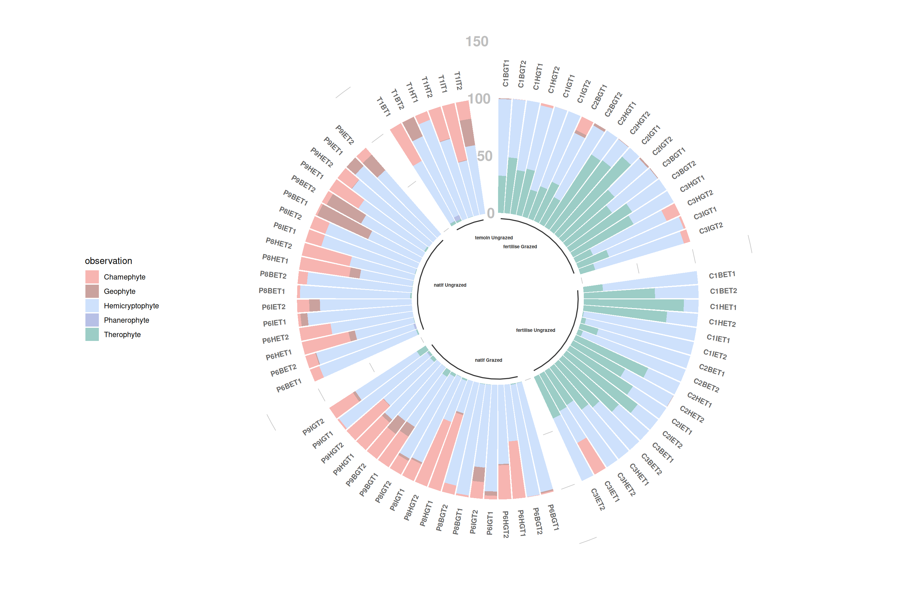

# Stage_M2_Devresse

## Dans quelles conditions des changements évolutifs de faible ampleur induisent des changements écologiques majeurs ?
Modélisation, éco-évo, boucle de rétroaction, dynamique adaptative

